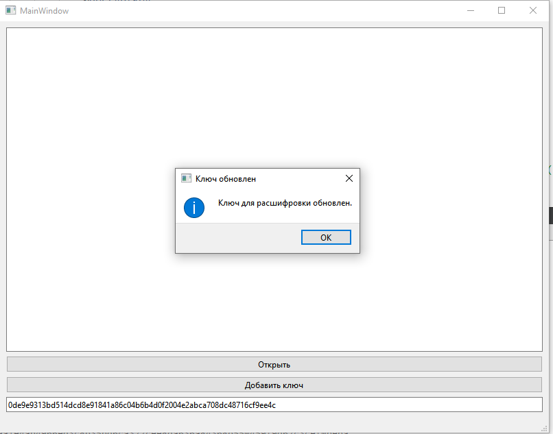

# Транзакции

## Описание работы программы
Программа для проверки транзакций использует алгоритм AES-256 для расшифровки зашифрованных файлов транзакций. Пользователь может ввести ключ расшифровки и открыть зашифрованный файл для анализа. Программа проверяет хэш каждой транзакции и выделяет красным цветом неправильные записи. Приложение удобно в использовании и поддерживает обновление ключа без пересборки.
Два зашифрованных файла и два ключа
transactions.enc - 008bf68a2f5b81c7956a89ab6851ec7d5dd205159d8bf889e229d556898cfffb
transactions2.enc - 0de9e9313bd514dcd8e91841a86c04b6b4d0f2004e2abca708dc48716cf9ee4c

## Как работает кнопка добавления ключа
Пользователь может ввести ключ расшифровки в специальное поле и нажать кнопку "Добавить ключ". После этого ключ будет использоваться для расшифровки файлов транзакций. Если ключ введен неправильно, программа уведомит пользователя об ошибке.

## Как работает кнопка открытия файла
Для открытия файла транзакций пользователь нажимает кнопку "Открыть". Откроется диалоговое окно, в котором можно выбрать зашифрованный файл. После выбора файла программа расшифрует его и отобразит транзакции в текстовом поле. Неправильные транзакции будут выделены красным цветом.

## Процесс расшифровки
Программа использует введенный пользователем ключ и фиксированный IV для расшифровки файла транзакций. Зашифрованные данные читаются из файла и расшифровываются с использованием алгоритма AES-256 в режиме CBC. После расшифровки данные проверяются и отображаются в пользовательском интерфейсе.

